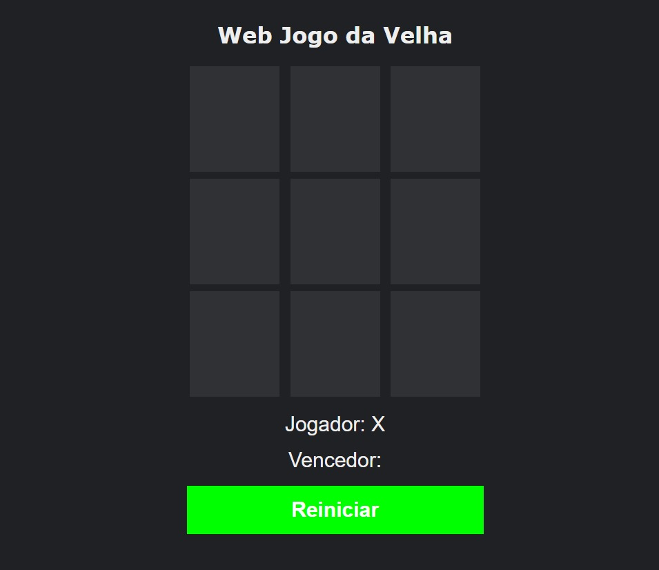

# WEB JOGO DA VELHA
Esse projeto é o resultado de um desafio de projeto realizado na plataforma da [DIO](https://web.dio.me/project/criando-seu-proprio-jogo-da-velha-com-html-e-javascript/learning/77459b5a-ef9a-4b9f-8806-e76e00a84a97?back=/track/orbi-web-game-developer&tab=undefined&moduleId=undefined), em que foi criado um Web Jogo da Velha.

### __Link do jogo:__ [https://rodolfosouzamenezes.github.io/web-jogo-da-velha/](https://rodolfosouzamenezes.github.io/web-jogo-da-velha/)

## Demostração do jogo

## O jogador terá a opção de reiniciar o jogo
